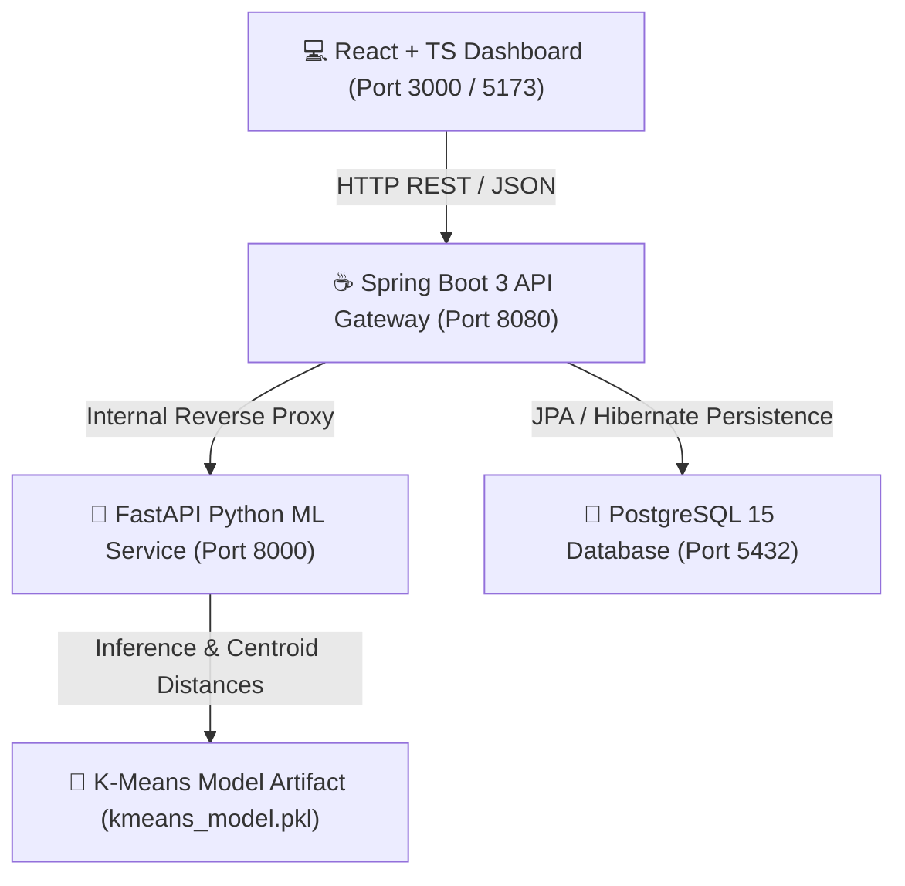

# SegmIntel — AI Customer Segmentation Dashboard v1

[](https://github.com/Sakshamjain222/Customer-Segmentation-using-K-Means-v1)
[](https://fastapi.tiangolo.com/)
[](https://spring.io/projects/spring-boot)
[](https://react.dev/)
[](https://www.docker.com/)

An autonomous, full-stack enterprise AI Customer Segmentation & Marketing Intelligence system built on modern microservices architecture. Powered by **K-Means Clustering ($K=5$)**, **Spring Boot 3 REST API Gateway**, and a **React + TypeScript + Vite Dashboard** with obsidian glassmorphic UI.

---

## 🏗️ System Architecture



### Microservices Breakdown
1. **Frontend (`./frontend`)**: React 18, TypeScript, Vite, Recharts, and Lucide icons. Features dark-mode glassmorphism, responsive data grids, drag-and-drop CSV batch upload, and real-time scatter explainability.
2. **Backend API Gateway (`./backend`)**: Java 17 + Spring Boot 3. Acts as the central orchestrator, logging predictions to PostgreSQL/H2 via Spring Data JPA and proxying machine learning requests.
3. **ML Microservice (`./ml-service`)**: Python 3.10 + FastAPI + Scikit-Learn. Handles unsupervised K-Means clustering ($K=5$), feature scaling (`StandardScaler`), centroid distance computations, and automated strategy insights generation.

---

## ✨ Key Features

- **Real-Time Single Profile Classification**: Input customer age, gender, annual income, and spending score to compute precise Euclidean distances against learned cluster centroids.
- **High-Throughput Batch CSV Processing**: Drag-and-drop retail datasets (`.csv`) for multi-profile classification, preview telemetry data, filter by segment, and export segmented CSV reports.
- **Deep-Dive Visual Analytics**: Interactive 2D Recharts scatter projections of *Annual Income vs. Spending Score* color-coded by cluster, alongside WCSS Elbow optimization curves ($K=1..10$).
- **Automated Business Strategy Generation**: Real-time AI recommendations tailored to assigned customer segments (e.g., VIP Loyalty Programs for High Value Spenders, Discount Bundles for Budget Conscious profiles).

---

## 🚀 Quick Start & Deployment

### Option A: Docker Compose (Recommended)
Launch the entire containerized stack with one command:
```bash
docker compose up --build
```
- **Dashboard UI**: http://localhost:3000
- **Spring Boot Gateway**: http://localhost:8080/api/v1/clusters/summary
- **FastAPI Docs**: http://localhost:8000/docs

### Option B: Local Development
**1. Start ML Microservice:**
```bash
cd ml-service
pip install -r requirements.txt
python -m uvicorn app.main:app --host 0.0.0.0 --port 8000
```

**2. Start Spring Boot Backend:**
```bash
cd backend
mvn spring-boot:run
```

**3. Start React Dashboard:**
```bash
cd frontend
npm install
npm run dev
```

---

## 📊 Identified Customer Clusters ($K=5$)

| Cluster ID | Segment Label | Avg Annual Income | Avg Spending Score | Key Strategy |
| :---: | :--- | :---: | :---: | :--- |
| **#0** | **Budget Conscious** | Low (~$25k) | Low (~20) | Value-driven promotions & essential bundles |
| **#1** | **Impulsive Shoppers** | Low (~$26k) | High (~78) | Flash sales, social proof, and limited-time offers |
| **#2** | **High Value Spenders** | High (~$86k) | High (~82) | Premium concierge, VIP rewards, and exclusive launches |
| **#3** | **Conservative Spenders** | High (~$88k) | Low (~17) | High-quality craftsmanship, long-term warranties |
| **#4** | **Average Spenders** | Mid (~$55k) | Mid (~49) | Tiered loyalty rewards & seasonal recommendations |

---

## 📝 License
This project is open-source under the MIT License. Developed autonomously following production-grade software engineering standards.