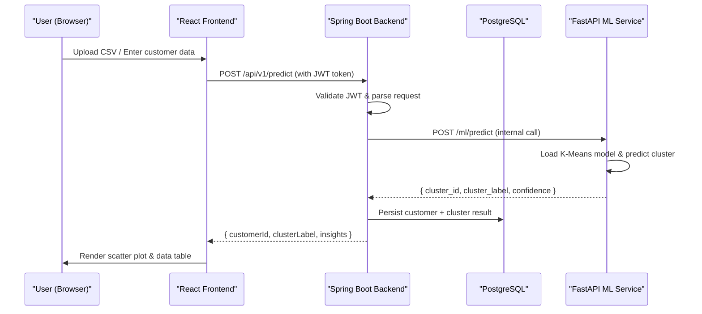

# Tech Spec — Customer Segmentation Dashboard

Project: Customer Segmentation using K-Means (https://app.notion.com/p/Customer-Segmentation-using-K-Means-1833abd85889418cac349823aa840041?pvs=21)
Status: In progress
Type: Spec

# ⚙️ Technical Specification & Architecture Document

### Customer Segmentation Web Application Dashboard

---

## 1. 📋 Executive Summary

The goal of this web application is to transform the trained **K-Means Customer Segmentation model** into a production-grade, interactive dashboard that business stakeholders can use without any coding knowledge.

The application will allow users to:

- **Upload** new customer CSV data via a clean UI
- **Receive real-time cluster predictions** from the ML model
- **Visualize** customer segments through interactive charts and scatter plots
- **Export** segmented results for downstream marketing use

The system is designed as a **microservices architecture** with clear separation of concerns: a React frontend for user interaction, a Spring Boot backend for business logic and security, and a FastAPI Python microservice dedicated solely to serving the ML model.

---

## 2. 🏗️ System Architecture

### Service Overview

| Service | Technology | Responsibility |
| --- | --- | --- |
| **Frontend** | React + Recharts/Plotly | UI, data visualization, user interaction |
| **Backend** | Spring Boot (Java) | Auth, routing, business logic, data persistence |
| **ML Microservice** | Python + FastAPI | Load K-Means model, serve predictions |
| **Database** | PostgreSQL | Store customer data & cluster results |

### Communication Flow

The React frontend communicates **only with the Spring Boot backend** via REST. Spring Boot acts as the API gateway — it handles authentication and then forwards prediction requests to the FastAPI ML microservice internally. The ML service is **not exposed publicly**.



---

## 3. 🔌 API Specifications

### Spring Boot → Client Endpoints

#### `POST /api/v1/predict/single`

Predict cluster for a single customer.

**Request Payload:**

```json
{
  "customerId": "CUST-1042",
  "age": 34,
  "annualIncome": 72,
  "spendingScore": 61,
  "gender": "Female"
}
```

**Response:**

```json
{
  "customerId": "CUST-1042",
  "clusterId": 2,
  "clusterLabel": "High Value Spender",
  "confidence": 0.87,
  "insights": "This customer belongs to a high-income, high-spending segment. Recommended for premium loyalty programs."
}
```

---

#### `POST /api/v1/predict/batch`

Predict clusters for a full CSV upload.

**Request:** `multipart/form-data` with `file` field (CSV)

**Response:**

```json
{
  "jobId": "job-20240701-001",
  "status": "completed",
  "totalRecords": 200,
  "results": [
    { "customerId": "CUST-1001", "clusterId": 1, "clusterLabel": "Budget Conscious" },
    { "customerId": "CUST-1002", "clusterId": 3, "clusterLabel": "Premium Shopper" }
  ]
}
```

---

#### `GET /api/v1/clusters/summary`

Get aggregated stats per cluster for dashboard KPIs.

**Response:**

```json
{
  "clusters": [
    { "clusterId": 1, "label": "Budget Conscious", "count": 48, "avgIncome": 32, "avgSpendingScore": 25 },
    { "clusterId": 2, "label": "High Value Spender", "count": 35, "avgIncome": 88, "avgSpendingScore": 79 }
  ]
}
```

---

### FastAPI (Internal) ML Endpoints

#### `POST /ml/predict`

Internal only — called by Spring Boot.

**Request:**

```json
{
  "features": {
    "age": 34,
    "annual_income": 72,
    "spending_score": 61
  }
}
```

**Response:**

```json
{
  "cluster_id": 2,
  "distances": [12.4, 3.1, 18.7, 9.2]
}
```

#### `GET /ml/health`

Health check for the ML service.

---

## 4. 🖥️ Frontend Component Blueprint

### App Shell

- **`<App />`** — Root component, sets up routing and auth context
- **`<NavBar />`** — Top navigation with user info and logout
- **`<Sidebar />`** — Navigation links to dashboard sections

### Pages

- **`<DashboardPage />`** — Main landing with KPI cards and cluster overview
- **`<PredictPage />`** — Single customer prediction form
- **`<BatchUploadPage />`** — CSV upload and batch prediction results
- **`<AnalyticsPage />`** — Deep-dive charts and segment comparisons

### Data Input Components

- **`<CustomerForm />`** — Input fields for Age, Income, Spending Score, Gender
- **`<CsvUploader />`** — Drag-and-drop CSV upload with validation and preview
- **`<FilePreviewTable />`** — Preview first N rows of uploaded CSV before submission

### Visualization Components

- **`<ClusterScatterPlot />`** — 2D scatter plot (Income vs. Spending Score), color-coded by cluster using **Recharts** or **Plotly.js**
- **`<ElbowCurveChart />`** — Static chart showing WCSS vs. K for model explainability
- **`<ClusterKpiCards />`** — Cards showing count, avg income, avg spending score per cluster
- **`<ClusterBarChart />`** — Bar chart comparing cluster sizes

### Results Components

- **`<PredictionResultCard />`** — Displays cluster label, ID, confidence, and insight text for a single prediction
- **`<BatchResultsTable />`** — Sortable/filterable table of all batch prediction results
- **`<ExportButton />`** — Triggers CSV download of segmented results

---

## 5. 🐳 Deployment Strategy

### Containerization with Docker

Each service gets its own `Dockerfile` and they are orchestrated together via **Docker Compose** for local development.

**`docker-compose.yml` structure:**

```yaml
services:
  frontend:
    build: ./frontend
    ports:
      - "3000:3000"
    depends_on:
      - backend

  backend:
    build: ./backend
    ports:
      - "8080:8080"
    environment:
      - ML_SERVICE_URL=http://ml-service:8000
      - DB_URL=jdbc:postgresql://db:5432/segmentation
    depends_on:
      - db
      - ml-service

  ml-service:
    build: ./ml-service
    ports:
      - "8000:8000"
    volumes:
      - ./ml-service/models:/app/models

  db:
    image: postgres:15
    environment:
      - POSTGRES_DB=segmentation
      - POSTGRES_PASSWORD=secret
```

### Production Deployment Recommendations

- **Cloud Provider:** AWS (ECS/EKS) or GCP (Cloud Run / GKE)
- **Frontend:** Deploy React build to **AWS S3 + CloudFront** (CDN for fast global delivery)
- **Backend:** Deploy Spring Boot as a container on **AWS ECS Fargate** or **Kubernetes**
- **ML Service:** Deploy FastAPI on **AWS ECS** or **Google Cloud Run** (scale to zero when idle)
- **Database:** Use **AWS RDS (PostgreSQL)** for managed, scalable storage
- **Reverse Proxy:** Use **NGINX** in front of all services for SSL termination and routing
- **CI/CD:** Set up **GitHub Actions** to build Docker images and push to ECR on every merge to `main`

---

*Document authored for Saksham Jain — Customer Segmentation ML Project*